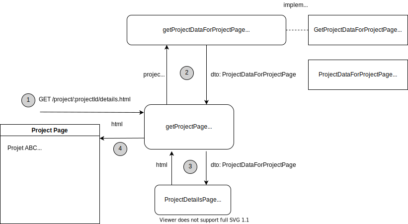
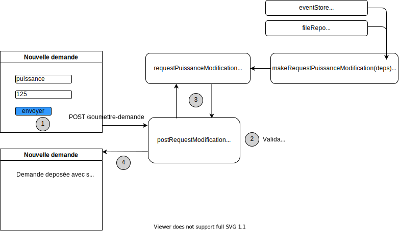
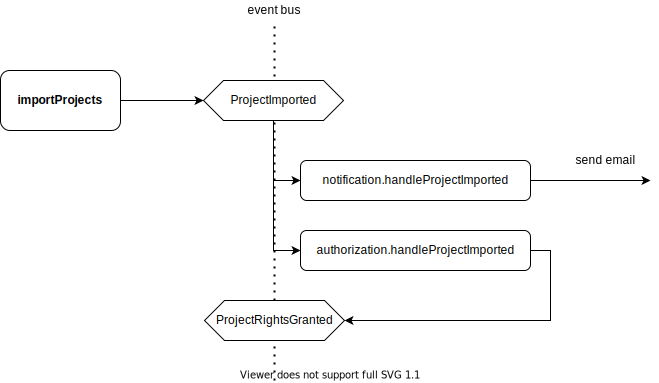
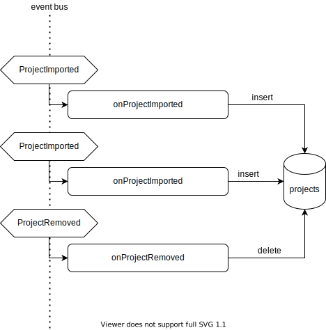

# Architecture

Ceci est un document à destination des développeurs de Potentiel et qui traite d'architecture, c'est à dire de l'agencement des différentes briques techniques qui constituent l'application Potentiel. Il est le complémentaire théorique du document [Recipes](RECIPES.md) qui est plus orienté pratique et explique comment mettre en oeuvre des besoins concrets.

## Sommaire

- [Principe fondamental: le découplage](#principe-fondamental-le-découplage)
- [Séparation des requêtes et des commandes](#séparation-des-requêtes-et-des-commandes)
  - [Query](#query)
  - [Command](#command)
- [Event Sourcing: architecture orientée événements](#event-sourcing)
- [Transactions et Agrégats](#agrégats)
- [Result/ResultAsync: encapsulation des erreurs](#result--resultasync)

## Principe fondamental: le découplage

Ce qu'on cherche à obtenir en séparant l'application en plusieurs briques distinctes est le découplage de celles-ci. On entends par là, que chaque brique ne dépend pas des autres briques. Un changement sur un module, n'impacte pas le changement sur les autres modules.
Concrètement, en javascript, cela veut dire qu'un module n'effectue pas d'`import` des modules avec lesquels on souhaite le découpler.

Les raisons de ce découplage sont les suivantes:

- **Maintenabilité**: avec chaque brique indépendante des autres, il est plus simple de mettre à jour une partie de l'application sans casser le reste.
- **Testabilité**: chaque brique a son propre test. Le test n'est impacté que par une portion très limitée de l'application (ie le scope fonctionnel de cette brique).
- **Lisibilité**: c'est plus simple de comprendre les tenants et aboutissants d'un module quand il ne dépend pas des autres.

Des exemples de découplage:

- séparer la logique métier des accès à la base de données
  - rend possible un changement de base de données sans toucher au code métier
  - rend possible l'usage de plusieurs bases de données en même temps (par exemple, pour le developpement local d'une part et la production d'autre part)
- isoler toutes les interactions avec des API ou librairies tiers
  - pour pouvoir changer de fournisseur d'envoi de mail par exemple
  - pour pouvoir remplacer une librairie par une autre
- ...

Evidemment, les différentes briques vont avoir besoin de s'interfacer pour que l'application fonctionne et il faudra donc les relier. Sans `import` cela parait compliqué. La solution s'appelle l'**injection de dépendance**. Le principe est que chaque module déclare ses dépendances sous la forme d'interface et reçoit ensuite ses dépendances lors de son instantiation.

### Exemple de mise en oeuvre

Prenons un exemple très simple. Nous avons une base d'utilisateurs et nous souhaitons créer une méthode `isUserAdult` qui nous retourne `true` si l'utilisateur a plus de 18 ans et `false` sinon.

**AVANT**

```ts
// isUserAdult.ts
import { fetchUser } from 'database'

export const isUserAdult = async (userId: string){
  const user = await fetchUser(userId)
  return user.age >= 18
}
```

Il y a un couplage entre `isUserAdult` et `database` à cause de l'import.

On ressent ce couplage dans le test:

```ts
// isUserAdult.test.ts
import { isUserAdult } from 'isUserAdult.ts'
import { resetDatabase, insertUser } from 'database'

describe('isUserAdult', () => {
  it('should return true if the user is more than 18 years old', async () => {
    await resetDatabase()
    await insertUser({ userId: '1234', age: 19 })

    const isAdult = await isUserAdult('1234')
    expect(isAdult).toEqual(true)
  })

  it('should return false if the user is less than 18 years old', async () => {
    await resetDatabase()
    await insertUser({ userId: '1234', age: 17 })

    const isAdult = await isUserAdult('1234')
    expect(isAdult).toEqual(false)
  })
})
```

L'issue du test dépend non seulement de l'implémentation (est-ce que j'ai bien écrit ma comparaison ?) et aussi de l'état de fonctionnement de la base de données (est-ce que `fetchUser` me renvoit bien un utilisateur complet? est-ce que `insertUser` a bien fonctionné ?). Ce n'est pas idéal puisque le test peut casser pour plusieurs raisons.

Ce sera un test lent, car les opérations sur la base sont relativement lentes, et couplé avec la base de données. Si nous changeons de base de données, le test comme l'implémentation seront obsolètes.

Ce que nous cherchons réellement à tester c'est la règle métier (`user.age >= 18`), c'est dommage que la base de données soit impliquée.

**APRES**

La méthode `isUserAdult` doit bien avoir accès à l'utilisateur mais peut être découplée de la base de données et plus précisément de l'implémentation de `fetchUser`. En réalité, `isUserId` n'a besoin que d'une méthode qui prend un `userId` en paramètre et retourne l'age de l'utilisateur correspondant.

```ts
// pas d'import, pas de couplage

// myMethod.ts
// Je déclare la forme de ma dépendance avec une interface
interface IsUserAdultDeps {
  getUserAge: (userId: string) => Promise<number>
}

export const makeIsUserAdult = ({ getUserAge }: IsUserAdultDeps) => async (userId: string){
  const age = await getUserAge(userId)
  return age >= 18
}
```

Au lieu d'exposer l'implémentation, j'expose une méthode
`makeIsUserAdult` prend les dépendances en paramètre et retourne une méthode. Je suis libre d'injecter l'implémentation que je veux dans `makeIsUserAdult`.

Le test ressemble à ça:

```ts
// isUserAdult.test.ts
import { makeIsUserAdult } from 'isUserAdult.ts'

describe('isUserAdult', () => {
  it('should return true if the user is more than 18 years old', async () => {
    // Une "fausse" implémentation sur mesure pour le test
    const getUserAge = async (userId: string) => 19 // <--

    // J'injecte ma fausse implémentation, elle est conforme à l'interface
    const isUserAdult = makeIsUserAdult({ getUserAge })

    const isAdult = await isUserAdult('1234')
    expect(isAdult).toEqual(true)
  })

  it('should return false if the user is less than 18 years old', async () => {
    // Une variante pour ce scénario de test
    const getUserAge = async (userId: string) => 17 // <--

    const isUserAdult = makeIsUserAdult({ getUserAge })

    const isAdult = await isUserAdult('1234')
    expect(isAdult).toEqual(false)
  })
})
```

Le test n'est plus couplé à la base de données. Il ne vérifie que la règle métier. Il sera rapide à écrire et à executer.

### Quel découplage / découpage pour Potentiel ?

Il existe de nombreuses manières de découper une application pour obtenir ce découplage. Chez Potentiel, nous avons opté pour la [clean architecture](https://blog.cleancoder.com/uncle-bob/2012/08/13/the-clean-architecture.html) ou [hexagonal architecture](https://blog.octo.com/architecture-hexagonale-trois-principes-et-un-exemple-dimplementation/).

Le code métier se trouve dans le dossier `modules` et le code infrastructure (bases de données, api tiers, ...) se trouve dans le dossier `infra`.
Le serveur d'application est lancée par le `server.ts`, qui lance le serveur express et branche les controlleurs qui sont situés dans le dossier `controllers`. Cette application n'appelle pas directement les briques métiers situées dans `modules` mais importe les versions dans lesquels les dépendances ont déjà été injectées dans le dossier `config` (c'est là où nous choisissons quelle implémentation injecter dans quel module métier).

Nous verrons des exemples dans les sections suivantes.

## Séparation des requêtes et des commandes

Pour bien comprendre l'architecture, il est important de savoir que nous appliquons le principe de [CQRS](https://www.insidegroup.fr/actualites/cqrs/) qui veut dire "Command Query Responsibility Segregation". Nous séparons, dans l'application, les composants qui traitent d'une lecture simple (sans effet sur le système, appelé _Query_) des composants en écriture (qui modifient le système, appelé _Command_).

[retour au sommaire](#sommaire)

### Query

Dans notre application, nous sommes typiquement dans le cas d'une query lorsque nous voulons afficher une page avec du contenu.

Prenons le cas de la page projet. C'est la page sur laquelle nous affichons toutes les données d'un projet. Du point de vue du client, nous effectuons une requête GET sur `/projet/:projectId/details.html` (avec `:projectId` l'identifiant du projet) et nous recevons en retour une page HTML avec toutes les informations du projet.

Voici le cheminement interne de la requête:

<p align="center"></p>

1. Le _controller_ `getProjectPage` écoute les requêtes GET de la forme `/project/:projectId/details.html`.
2. Il appelle la query `getProjectDataForProjectPage` dans son implémentation propre à Sequelize (qui est l'ORM que nous utilisons pour requêter notre base postgresql). Celle-ci implémente l'interface `GetProjectDataForProjetPage` qui est définie dans le module "project". Elle retourne un objet qui respecte l'interface `ProjectDataForProjectPage` (celui-ci est ce qu'on appelle un DTO pour "Data Transfer Object", un objet qui ne contient que de la donnée brute).
3. Ce DTO est ensuite passé à la vue `ProjectDetailsPage`, qui est un composant React qui est également conçu pour prendre un `ProjectDataForProjectPage` en rentrée. Ce composant nous retourne du html sous la forme d'une simple `string`.
4. Ce html est enfin retourné au client, qui voit apparaitre la page du projet.

Nous voyons qu'il y a très peu de code métier dans une query. Seules les interfaces `GetProjectDataForProjetPage` et `ProjectDataForProjectPage` sont issues du dossier `modules`.

C'est la query `getProjectDataForProjectPage` qui concentre la complexité. Elle sera l'objet d'un test d'intégration.
Voir la recette pour [Ecrire une query](RECIPES.md#ecrire-une-query).

[retour au sommaire](#sommaire)

### Command

Une commande est une requête du client qui va avoir un impact sur l'état de notre application, typiquement écrire dans la base de données (mais aussi envoyer un mail, écrire un fichier, ...). Une règle métier va s'appliquer pour déterminer la légalité de cette commande (autorisation de l'utilisateur, validité du contenu envoyé, ...) avant de déclencher l'écriture.  
Si la demande n'est pas légale, aucune écriture ne sera faite et une erreur sera retournée au client.  
Si la demande est légale, une écriture sera faite et rien ne sera retourné au client (à part un status http 200 ou une redirection vers une page de succès). La règle c'est qu'aucune donnée n'est renvoyée vers l'utilisateur par la commande (même pas une liste mise à jour ou autre).

Prenons l'exemple du dépot d'une demande de modification. L'utilisateur remplit un formulaire avec sa demande et le soumets. Notre controlleur va recevoir une requête de type POST avec les informations de la demande.

<p align="center"></p>

1. Le controlleur reçoit une requête de type POST avec les données du formulaire dans son corps.
2. Le controlleur effectue la validation des données du formulaire (légalité des valeurs, autorisation de l'utilisateur, présence de pièce jointe, etc.)
3. Si tout est bon, le controlleur appelle le _use-case_ (c'est comme ça que nous appelons les méthodes qui jouent le rôle de commande) `requestPuissanceModification` qui a été construit à partir de `makeRequestPuissanceModification` (qui contient la logique métier) et de ses dépendances provenant de la couche `infra`. Cette construction est faite dans le fichier `src/config/useCases.config.ts` lors du démarrage de l'application.
4. `requestPuissanceModification` retourne soit une erreur, soit rien. S'il s'agit d'une erreur, nous redirigeons vers une page pour afficher cette erreur. Sinon, nous redirigeons vers une page qui affiche un message de succès.

_NB: Les effets de bords (ex: écriture en base) sont intégralement effectués par le use-case._

La pièce centrale des commandes est donc le `use-case` qui comporte toutes les règles métier et qui déclenche les effets de bord. Le controlleur parse le corps de la requête, effectue une pré-validation et passe les paramètres propres au use-case.

Le use-case est couvert par un test unitaire.

Les dépendances d'un use-case peuvent être de divers nature:

- une query (pour récupérer des informations nécessaires au traitement)
- des données issues de variables d'environnement
- l'eventbus si on doit émettre un événement (voir section [Event Sourcing](#event-sourcing))
- un repository, pour appeler un agrégat (voir section sur les [Agrégats](#agregats))
- ...

Un use-case renvoit toujours soit `null` (ie rien) soit une erreur (le tout, encapsulé dans un [`ResultAsync`](#result-resultasync))

[retour au sommaire](#sommaire)

## Event Sourcing

Nous avons adopté un fonctionnement orienté événement dans la grande majorité de notre application. C'est d'abord un outil au service du découplage. En effet, au lieu d'avoir un use-case qui appelle directement tous les effets nécessaires, un événement est émis sur un bus (canal de communication partagé) et des handlers différens peuvent écouter cet événement pour déclencher différents effets localisés.
Par exemple, si nous prenons le use-case `importProjects`, celui-ci a les effets suivants:

- Mettre à jour la liste des projets en base
- Prévenir les utilisateurs concernés qu'ils ont de nouveaux projets disponibles
- Affecter ces projets aux comptes utilisateurs correspondants (droits)

Ces effets sont de contextes très différents. Les emails, par exemple, sont dans le contexte "notification", alors que les droits sont gérés par le contexte "authorization".
Nous pourrions avoir une méthode `sendEmail` et une autre `grantRights` qui sont appelés par `importProjects` mais cela crée un couplage entre des parties indépendantes de notre application. Par ailleurs, il se peut qu'on importe des milliers de projets en simultané, et comme l'envoi d'email ou la mise à jour de la base de données prennent un temps non-négligeables, notre use-case mettrait potentiellement un temps très long pour s'executer.

### L'event bus

Toutes les parties de l'application partagent le même bus de communication appelé `Event Bus` et peuvent émettre comme écouter les événements qui passent dessus, en temps réel. Chaque événement a un type, qui porte le verbe du use-case correspondant au participe passé (ex: `grantRights` => `RightsGranted`), ainsi qu'un payload, qui contient toutes les données attachées à l'événement (un id de projet, d'utilisateur, une date, etc).

Dans notre architecture orientée événements, le use-case `importProjects` émet un événement `ProjectImported` pour chacun des projets importés. C'est son seul effet.

### Les effets

`ProjectImported` est ensuite écouté au sein du module "notification" pour envoyer un mail si nécessaire et aussi par le module "authorization" pour rajouter des droits (via l'émission d'un autre événement). Ces deux handlers peuvent avoir des règles métier spécifiques. Ce sont des use-cases eux-mêmes.

<p align="center"></p>

Je suis libre de rajouter autant de comportements secondaires à partir de l'écoute des événements. Par ailleurs, si un autre use-case émet le même événement `ProjectImported`, alors mes effets secondaires sont déjà en place. Ceci limite les répétitions dans le code.

### Les projections

Dans cette architecture, toute commande qui réussit émet un ou plusieurs événements. C'est leur seul effet, et il n'y a pas d'écriture en base de données. Ainsi, tout l'état du système peut être entièrement décrit par la suite des événements qui ont été émis. C'est pourquoi tous les événements sont sauvegardés dans une table spéciale, qu'on appelle `EventStore`. C'est notre **seule source de vérité**. Par exemple, si nous voulons la liste des projets, il suffit de sortir la liste des événements `ProjectImported`.

_Le principe d'utiliser un historique d'événements comme source de vérité est appelé [`Event Sourcing`](https://martinfowler.com/eaaDev/EventSourcing.html)._

Toutefois, le requêtage à partir de l'historique peut être un peu compliqué (par exemple, si j'ai aussi des événements `ProjectRemoved`, je ne pourrais pas me contenter d'aller chercher les `ProjectImported` pour avoir la liste des projets). Pour simplifier les requêtes, nous utilisons des tables de base de données qui détiennent une partie de l'état du système. On parle de `projection` ou `vue`.

Ces tables sont mises à jour par des handlers spéciaux qui écoutent l'event bus. Un handler qui écoute `ProjectImported` va, par exemple, rajouter une ligne à la table `projects` et le handle qui écoute `ProjectRemoved` va retirer une ligne de cette même table. Ainsi, la table `projects` contiendra l'état à date du système.

<p align="center"></p>

_**ATTENTION !** les projections sont des vues mises à jour de manière asynchrone, elles ne seront à jour qu'**après le traitement de tous les événements**. C'est très important de garder en tête que **ce n'est pas immédiat**. Si on effectue une requête sur une table immédiatement après avoir émis un événement, celle-ci ne sera pas à jour. On parle de **Eventual Consistency**._

### Conception des projections

Le contenu des projections est entièrement déterminé par l'historique des événements. Il est donc possible de détruire les tables et de les recréer à partir de l'event store. Elles sont de fait jetables.

Ceci nous donne beaucoup de liberté dans la conception des projections.

- Nous pouvons ajouter une colonne
- Nous pouvons créer une nouvelle projection a posteriori et la remplir à partir de l'historique
- Nous pouvons créer des tables spécifiques, pour des raisons de performances (par exemple, une table qui ne contient que le nom des projets)
- Nous pouvons utiliser une autre base de données pour certaines projections

Nous pouvons voir les `projections` comme une sorte de cache de données, créé pour les besoins des `queries`.

### Problème de concurrence

Comme l'état des projections n'est pas garantie d'être à jour, il est fortement déconseillé d'utiliser les données des projections pour faire des vérifications dans le cas d'une commande.

Imaginons un use-case `acceptRequest`, que doit vérifier que le projet a une puissance inférieure à 100.  
Lors de l'appel à `acceptRequest`, la table `projects` peut avoir une puissance de 80 pour ce projet. Mais dans l'event store, il y a un événement `PuissanceChanged` (qui change la puissance à 120), qui n'a pas encore donné lieu à une mise à jour de la table `projects`. Dans ce cas, nous baser sur la table `projects` nous conduirait à faire une erreur.

Nous parlons d'un problème de "concurrence". Plusieurs ordres contradictoires peuvent arriver en même temps et, si on ne les traite pas de manière appropriée, le système peut faire des choses illégales ou mettre le système dans un état qui devrait être impossible. C'est un problème universel dans les systèmes informatiques. Nous adressons ce problème dans la section qui traite des [Agrégats](#agrégats).

[retour au sommaire](#sommaire)

## Agrégats

Dans le cas des commandes, nous devons parfois utiliser l'état du système (les données) pour savoir si une règle métier passe ou pas. Comme dans l'exemple précédent de `acceptRequest`, notre règle métier est "puissance inférieure à 100" et cette puissance doit être récupérée pour l'appliquer.
Nous avons vu qu'il est hasardeux d'utiliser les valeurs présentes dans les projections, parce qu'elles peuvent être obsolètes.

Nous devons donc récupérer cette valeur de l'event store qui est notre source de vérité. Cela ne règle toutefois pas le problème de concurrence, dans le sens où il pourrait se passer des nouveaux événements en même temps.

La solution est d'ouvrir une _transaction_.

### Transaction

Dans le cas d'une base de données classique, une transaction permet de grouper une série de requêtes sur la base (par exemple, une lecture et une écriture), de telle manière à être assuré qu'elles seront executées ensemble, sans problème de concurrence (ie sans requêtes qui seraient executée entre mes requêtes groupées).

Dans notre cas, la transaction va bloquer l'event store temporairement, pour s'assurer qu'aucun événement ne peut être émis pendant ce temps. Dans notre exemple, nous souhaitons d'abord lire l'historique pour trouver la dernière valeur de puissance pour ce projet et ensuite, si la puissance est inférieure à 100, nous souhaitons émettre un événement `RequestAccepted`. Le fait de passer par une transaction va nous assurer qu'aucun événement ne puisse être émis entre les deux.

Lorsque plusieurs process essayent d'ouvrir une transaction en même temps, l'event store va traiter les transactions dans leur ordre d'arrivée et s'assurer que la transaction précédente est terminée avant de démarrer la suivante.

### Agrégats et Repository

Dans nos commandes, nous récupérons un historique d'événements afin de reconstruire l'état actuel du système, qui va nous permettre d'executer notre règle métier.

Pour des raisons de performance, nous ne reconstruisons pas l'intégralité de l'état du système à chaque commande. Nous ne reconstruisons qu'une partie de notre système, par exemple, l'état d'un projet ou d'une demande de modification particulière. Cet état partiel s'appelle un _agrégat_ (ou aggregate en anglais). Nous avons ainsi créé les agrégats `Project` ou encore `ModificationRequest`.

Pour traiter une règle métier sur un agrégat `Project`, nous allons récupérer tous les événements qui concernent ce projet (`ProjectImported`, `ProjectRemoved`, `PuissanceChanged`, ...). Ces événements sont reliés à ce projet via leur `aggregateId`, qui dans ce cas aura la valeur de notre id de projet.

L'ouverture d'une transaction sur l'historique pour récupérer tous les événements d'un agrégat est le rôle d'un _repository_. Chaque type d'agrégat a son propre repository. En typescript, on aura par exemple `projectRepo: Repository<Project>`. Un appel à `projectRepo.transaction(projectId, callback)`, va ouvrir une transaction, charger l'agrégat `Project` qui a pour id `projectId` et executer le `callback`. Quand le callback sera terminé, l'agrégat sera sauvegardé (cf plus bas) et la transaction sera fermée.

Voici les rôles de l'agrégat:

- reconstruire son état à partir d'une liste d'événements
  - par exemple, `puissance` devra être mis à jour par `ProjectImported` mais aussi `PuissanceChanged`
- mettre à disposition des commandes
  - par exemple, `Project.changePuissance(newPuissance)` émettra `PuissanceChanged` mais uniquement si le projet est toujours actif (c'est qu'on saura par la présence d'un `ProjectRemoved` dans l'historique)
- stocker une liste d'événements à émettre
  - les commandes n'émettent pas directement sur l'event bus, elles stockent les événements à émettre dans une liste `pendingEvents`

Vers la fin de la transaction, s'il n'y a pas eu d'erreur (ie la commande respecte les règles métier), alors le repository va se charger d'émettre tous les événements présents dans `pendingEvents` sur l'event store. C'est l'équivalent d'une sauvegarde. Ces événements seront émis dans l'event store avant que les autres transactions ne s'ouvrent.

Nous avons bien notre phase de lecture (création de l'agrégat à partir de l'historique) et notre phase d'écriture (émission des nouveaux événements), avec une garantie qu'elles seront groupées au sein de la transaction.

[retour au sommaire](#sommaire)

## Result / ResultAsync

En javascript, les erreurs sont propagées sur la pile d'execution, du scope le plus bas au scope le plus haut, jusqu'à ce qu'un bloc les "attrape" (via un bloc `try/catch`).

D'une certaine manière, nous savons que chaque méthode que nous créons peut soit fonctionner et retourne un résultat (disons de type `T`), soit `throw` une erreur.

L'inconvénient est que nous pouvons choisir un type pour les erreurs mais leur type est perdu quand elles se propagent. Je peux émettre un `EntityNotFoundError` mais pour le compilateur, mon `catch(e: Error)` pourrait recevoir des erreurs de tous les types. La type de ma méthode restera `(args) => T`, sans mentionner les types d'erreur possible. L'information est perdue.

Par ailleurs, si j'oublie de mettre un bloc `try/catch`, une erreur peut remonter sans être traitée et causer le crash de mon application entière.

Afin de remédier à ces deux inconvénients, nous utilsons un librairie qui s'appelle [`neverthrow`](https://github.com/supermacro/neverthrow) et qui nous donne des types `Result` et `ResultAsync` qui vont nous permettre d'encapsuler avec un typage fort, aussi bien le type de retour en cas de succès que les types d'erreurs que peuvent survenir.
`Result` est la version synchrone et `ResultAsync` la version asynchrone (l'équivalent de `Promise`).

Ainsi au lieu d'avoir une method de type `(args) => T` ou `(args) => Promise<T>`, nous aurons `(args) => Result<T, MyError>` ou `(args) => ResultAsync<T, MyError>`.

Ma méthode n'utilisera plus `throw new MyError()` pour émettre une erreur mais `return err(new MyError())`. L'erreur est vue comme un cas de retour classique et non plus comme une exception (d'où le nom de `neverthrow`).
En cas de réussite, on encapsule explicitement également le succès `return ok(123)`.

Lorsque je reçoit un résultat de type `Result`, je dois explicitement traiter le cas d'erreur. Au lieu d'utiliser `try/catch`, j'utilise `.isErr()`.

```typescript
const res: Result<string, MyError> = getName()

console.log(res.value) // Compiler Error ! Je ne sais pas si c'est une erreur encore
console.log(res.error) // Compiler Error ! Je ne sais pas si c'est une erreur encore

if (res.isOk()) {
  console.log(res.value) // le compilateur sait que c'est un succès grace à ma vérification
}

if (res.isErr()) {
  console.log(res.error) // Idem, le compilateur sait que c'est une erreur
}
```

Il est possible de transformer une `Promise` (par exemple, issue d'une librairie tiers), en `ResultAsync` grace à la méthode `ResultAsync.fromPromise()`.

Il y a également la possibilité de chainer les `Result` pour les transformer sans avoir à vérifier à chaque étape s'il s'agit d'une erreur ou pas (à la manière qu'on chaine les `Promise` avec `.then()`).

L'usage de cette libraire a vocation à rendre plus robuste la gestion des erreurs (on ne peut plus oublier de les traiter). Cela vient avec un certain coût en terme de développement (on ne peut plus utiliser `async/await` ou `try/catch`) et d'apprentissage. Les types sont parfois difficiles à lire puisque très explicites.

Pour plus d'information, merci de lire [la documentation officielle](https://github.com/supermacro/neverthrow).
