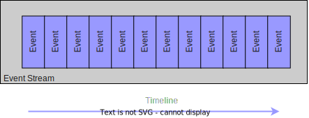
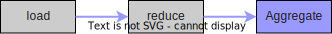
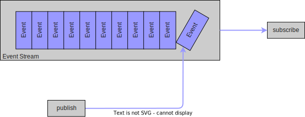
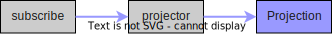
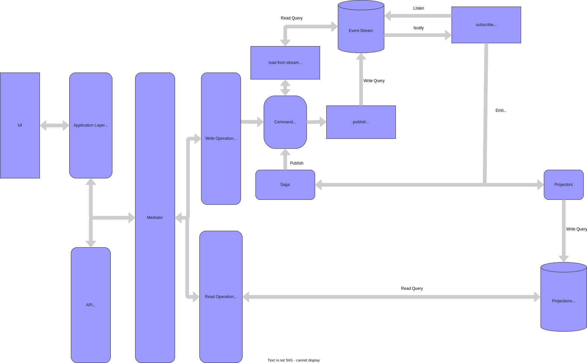

# Architecture

Dans cette documentation, vous trouverez les éléments clés concernant l'architecture du projet **Potentiel**.

L'application se base principalement sur deux patterns (qui seront abordés plus en détail dans la suite de cette documentation) :

- Event Sourcing
- Mediator

Le développement suit l'approche DDD (Domain Driven Design) ainsi que la méthode de test BDD (Behavior Driven Development).

## Event Sourcing

Le design pattern Event Sourcing est au centre de l'architecture. Une définition du pattern est disponible [ici](https://fr.wikipedia.org/wiki/Architecture_orient%C3%A9e_%C3%A9v%C3%A9nements).

Le pattern permet de capturer chaque changement d'état sous la forme d'un évènement et le persister dans un Event Store. Dans l'application le rôle de l'Event Store est porté par la base de données Postgres et les évènements sont stockés dans l'ordre via une timeline appellé **EventStream** :

Pour générer de nouveaux évènements, il est nécessaire de matérialiser un état sous la forme d'un agrégat. Pour ce faire, il faut charger l'ensemble des évènements liés à l'identifiant d'un agrégat (ce dernier est souvent l'identifiant naturel d'une entité métier, par exemple un Gestionnaire de Réseau est identifié par son CodeEIC). Une fois l'ensemble des évènements chargés, il faut les réduire afin d'extirper le dernier état de l'agrégat pour ensuite exécuter un comportement qui émettera de nouveaux évènements.

Chaque évènement émit doit être publié dans l'Event Store de manière ordonné et en gérant la concurrence. Dans Potentiel, l'ordre est garanti par la date de création (nom de la propriété : `createdAt`) et la version de l'aggrégat métier via lequel l'évènement a été créé (nom de la propriété : `version`). Ces deux propriétés sont gérés automatiquement dans la fonction `publish` du package **pg-event-sourcing** ([publish.ts](../../packages/libraries/pg-event-sourcing/src/publish.ts)). Les évènements sont stockés dans la table `EVENT_STREAM`.

> ⚠️ La version actuelle de bibliothèque ne gère pas la concurrence lors de la publication. Actuellement, le projet n'a pas suffisamment de trafic pour justifier de mettre en place la concurrence. Ce comportement sera ajouté par la suite si besoin.

Les évènements contenus dans l'Event Store sont immuables et ne peuvent donc être ni supprimés, ni modifiées. L'immuabilité est gérée dans Postgres sur la table `EVENT_STREAM` par les régles `PREVENT_DELETE_ON_EVENT_STREAM` et `PREVENT_UPDATE_ON_EVENT_STREAM`.

Une fois publié, l'évènement est propagé par pg_notify via le déclencheur `notify_new_event` La fonction `subscribe` du package **pg-event-sourcing** permet de récupérer l'évènement propagé dans le chanel `new_event` ([subscribe.ts](../../packages/libraries/pg-event-sourcing/src/subscribe.ts)).

Cette fonction permet de mettre en place une projection des données. La responsabilité des projecteurs dans le projet est de créer et mettre à jour les projections afin qu'elle puisse être consultées en lecture seule par l'application. L'ensemble de ces projections sont stockées dans la table `PROJECTION`. Les projections sont stockés sous la forme d'un key/value pair.

## Mediator et CQRS

Le projet utilise le pattern Mediator via la bibliothèque `mediateur`. Ce pattern permet d'établir une communication entre deux éléments d'un logiciel sans avoir de couplage. Pour cela, l'appelant passera par un médiateur qui sera capable de localiser et d'envoyer un message aux destinataires concernés. Ce pattern est utilisé pour le découpage et la mise à l'échelle du code. Il permet aussi de mettre en place facilement le principe de responsabilité (cf : [SOLID](https://en.wikipedia.org/wiki/SOLID)). Il est aussi utile pour mettre en place d'autre pattern, comme CQRS (Command & Query Responsability Sepration).

Le pattern CQRS définit qu'une application peut être découpé en deux partie, l'une dédiée à l'écriture (appelée `Command`), l'autre à la lecture (appelée `Query`). Chaque partie dispose de besoins spécifiques :

- Query : Facilité de requêtage, performance, ...
- Command : Execution de la logique, intégrité, validation, ...

CQRS et Event Sourcing vont souvent de pair car la séparation qu'impose le premier correspond à l'organisation du deuxième (Query/Projection + Command/Event).

## Architecture

Voici l'architecture générale actuelle du projet avec Event Sourcing & CQRS :

